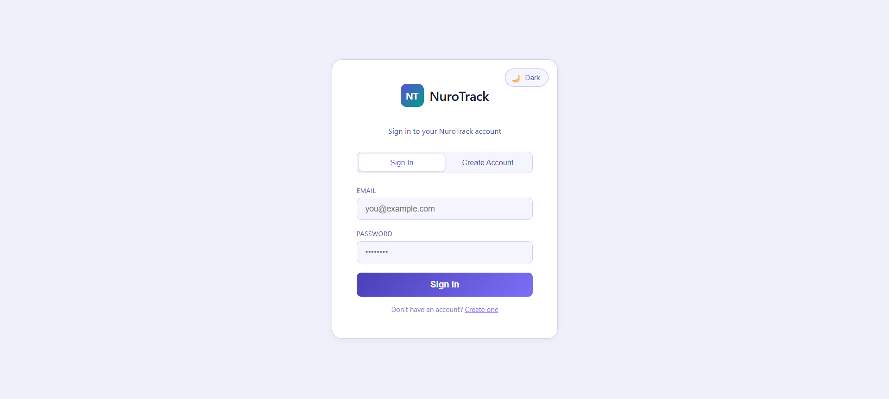
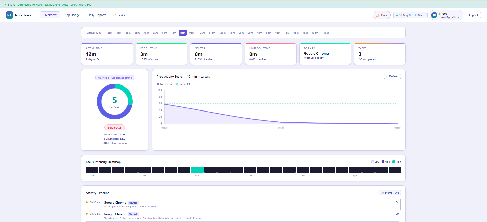
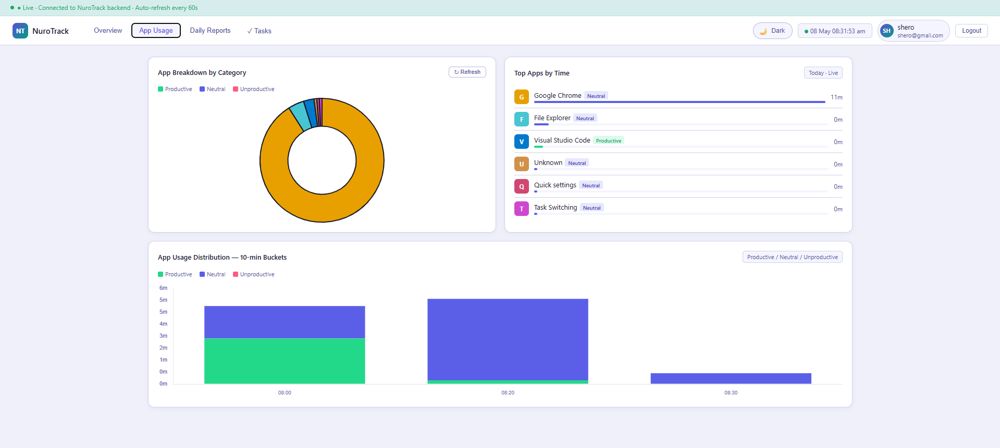
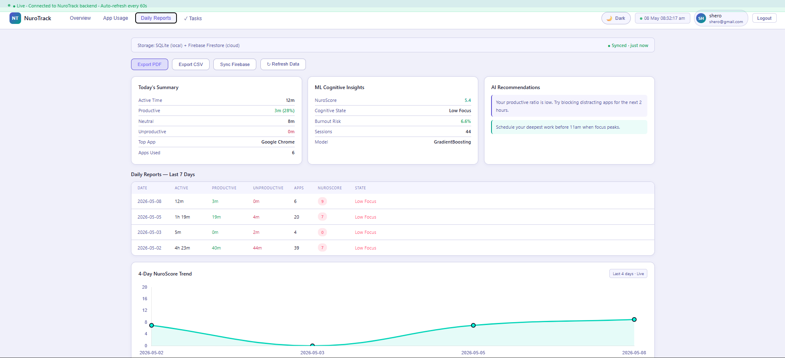
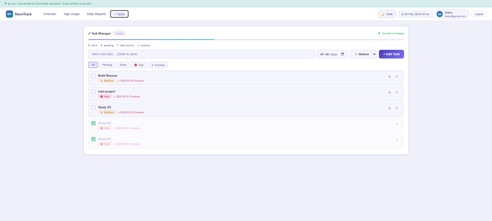

<div align="center">

# 🧠 NuroTrack

### AI-Powered Productivity Monitoring System using Machine Learning

Real-time desktop activity tracking, productivity analytics, behavioral insights, and ML-based cognitive scoring.

<br>


</div>

---

# 📌 Overview

NuroTrack is an AI-powered productivity monitoring platform designed to analyze user activity patterns, track application usage, and predict productivity levels using Machine Learning.

The system continuously monitors desktop activity in real time, categorizes productive and unproductive usage behavior, and generates intelligent productivity analytics through a custom ML-driven scoring system called **NuroScore**.

The project combines:
- Real-time desktop monitoring
- Behavioral analytics
- Machine Learning prediction
- Interactive dashboard visualization
- Firebase Authentication
- Productivity reporting system

---

# 🚀 Key Features

## 🔍 Real-Time Activity Tracking
- Monitors active windows and applications
- Tracks productive, neutral, and unproductive usage
- Calculates active work duration automatically

## 🧠 Machine Learning Productivity Prediction
- Gradient Boosting ML model
- Real-time productivity score prediction
- Behavioral pattern analysis
- Cognitive productivity estimation

## 📊 Interactive Analytics Dashboard
- Live productivity charts
- Daily and hourly reports
- App usage analytics
- Productivity trend visualization

## 🔐 Firebase Authentication
- Secure login system
- Token-based authentication
- Protected API routes

## 📋 Task Management
- Add and manage tasks
- Track workflow progress
- Daily productivity planning

## 📈 NuroScore Engine
Custom productivity score generated using:
- Productive ratio
- Session intensity
- App switching behavior
- Time-based work patterns
- Focus duration analysis

---

# 🏗️ System Architecture

```text
Frontend (HTML/CSS/JS)
        ↓
Flask API Server
        ↓
SQLite Database
        ↓
Machine Learning Engine
        ↓
Analytics & Prediction
```

---

# 🛠️ Tech Stack

## Backend
- Python
- Flask
- SQLite
- Firebase Admin SDK

## Frontend
- HTML5
- CSS3
- JavaScript
- Chart.js

## Machine Learning
- Scikit-learn
- Gradient Boosting Regressor
- NumPy
- Pandas

## Authentication
- Firebase Authentication

---

# 📂 Project Structure

```text
NuroTrack/
│
├── backend/
│   ├── main.py
│   ├── api.py
│   ├── auth.py
│   ├── config.py
│   ├── database.py
│   ├── firebase.py
│   ├── ml.py
│   ├── stats.py
│   └── tracker.py
│
├── frontend/
│   ├── index.html
│   └── styles.css
│
├── firebase/
│   └── serviceAccountKey.json
│
├── screenshots/
│   ├── login.png
│   ├── dashboard.png
│   ├── app-usage.png
│   ├── reports.png
│   └── tasks.png
│
├── requirements.txt
├── README.md
└── .gitignore
```

---

# ⚙️ Machine Learning Workflow

The system uses a **Gradient Boosting Regressor** to predict productivity behavior and generate the NuroScore.

## 📌 Feature Engineering

The ML model analyzes:
- Productive time ratio
- Unproductive activity ratio
- Session count
- Focus duration
- Activity hour patterns
- App switching frequency

## 📌 ML Pipeline

```text
User Activity
      ↓
Feature Extraction
      ↓
Feature Scaling
      ↓
Model Training
      ↓
Productivity Prediction
      ↓
Dashboard Visualization
```

## 📌 Prediction Output

The model predicts:
- Productivity score
- Cognitive state
- Focus quality
- Burnout risk patterns

---

# 📸 Screenshots

## 🔐 Login Page



---

## 📊 Dashboard Overview



---

## 💻 App Usage Analytics



---

## 📅 Daily Reports & ML Insights



---

## ✅ Task Management System



---

# 📊 Dashboard Modules

## 🏠 Overview
Displays:
- Active time
- Productive ratio
- NuroScore
- Burnout risk
- Cognitive state

## 💻 App Usage
Shows:
- Most used applications
- Usage duration
- Productivity categorization

## 📅 Daily Reports
Provides:
- Historical productivity reports
- Weekly trends
- Productivity analytics

## ✅ Tasks
- Add tasks
- Track workflow
- Manage daily productivity

---

# 🔌 API Endpoints

```text
GET /api/today
GET /api/sessions
GET /api/weekly
GET /api/hourly
```

---

# 🚀 Installation & Setup

## 1️⃣ Clone Repository

```bash
git clone https://github.com/AadityaChaudhary-git/NuroTrack.git
```

---

## 2️⃣ Open Project Folder

```bash
cd NuroTrack
```

---

## 3️⃣ Create Virtual Environment

### Windows

```bash
python -m venv venv
venv\Scripts\activate
```

### macOS / Linux

```bash
python3 -m venv venv
source venv/bin/activate
```

---

## 4️⃣ Install Dependencies

```bash
pip install -r requirements.txt
```

---

## 5️⃣ Configure Firebase

Place Firebase Admin SDK key inside:

```text
firebase/serviceAccountKey.json
```

---

## 6️⃣ Run Backend Server

```bash
cd backend
python main.py
```

Backend starts on:

```text
http://127.0.0.1:5050
```

---

## 7️⃣ Open Frontend

Open:

```text
frontend/index.html
```

using Live Server or browser.

---

# 📚 Learning Outcomes

This project demonstrates:
- Real-time desktop monitoring
- Flask backend development
- Firebase authentication integration
- Machine Learning workflow implementation
- Feature engineering techniques
- Data visualization
- SQLite database management
- Frontend-backend communication

---

# 🎯 Future Enhancements

- ☁️ Cloud synchronization
- 📱 Mobile application
- 🌐 Browser extension
- 🤖 AI productivity recommendations
- 👥 Team productivity analytics
- 🧩 Cross-device tracking

---

# 👨‍💻 Author

## Aditya Chaudhary

Bachelor of Computer Applications (BCA)  
Graphic Era Deemed to be University

---

# ⭐ Support

If you found this project useful, consider giving it a ⭐ on GitHub.

---

# 📄 License

This project is developed for academic and educational purposes.